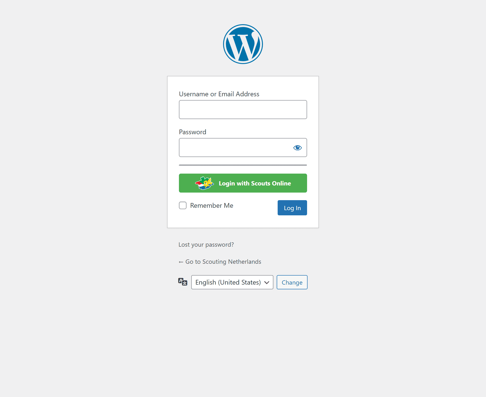
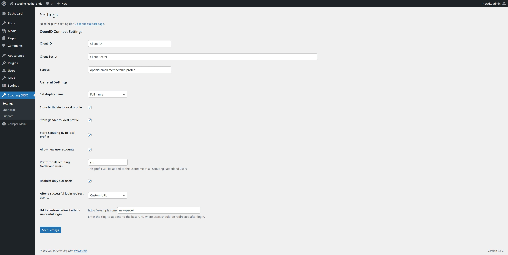

# Scouting Nederland Wordpress SOL Login

**Contributors:** [jobvk](https://github.com/jobvk) \
**Requires at least:** 6.4.3 \
**Tested up to:** 6.7.2 \
**Stable tag:** 1.0.1 \
**Tags:** scouting, scouting nederland, sol, openid connect, oidc \
**License:** GPLv3 \
**License URI:** https://www.gnu.org/licenses/gpl-3.0.html

Connect your Wordpress website to the Scouting Nederland OpenID Connect server.

## Index

* [Description](#description)
* [Screenshots](#screenshots)
* [Installation](#installation)
* [Configuration](#configuration)
* [Shortcodes](#shortcodes)
* [Frequently-Asked-Questions](#frequently-asked-questions)
* [Translations](#translations)

## Description

This plugin allows users to authenticate and login to their WordPress websites using their Scouting Nederland OpenID Connect credentials.

It provides a secure and convenient way for Scouting Nederland members to access their WordPress sites without the need for separate login credentials.

With this plugin, users can seamlessly integrate their Scouting Nederland accounts with their WordPress websites, enhancing the user experience and simplifying the login process.

Bugs and feature-requests can go to: [GitHub](https://github.com/Scouting-nl/scouting-openid-connect/issues) or [WordPress](https://wordpress.org/support/plugin/scouting-openid-connect)

## Screenshots

### 1. wp-login.php with scouting-login

### 2. Settings page

### 3. Shortcode page

### 4. Support page

## Installation

1. Log in to your WordPress admin dashboard.
2. Navigate to Plugins > Add New.
3. In the search bar, type the name of the plugin you want to install.
4. Find the plugin in the search results and click Install Now.
5. After the plugin is installed, click Activate.

## Configuration

Make sure you have the role `webmaster` in [sol.scouting.nl](https://sol.scouting.nl).

1. Go to [login.scouting.nl](https://login.scouting.nl), click on `Managed websites` and click on `Add OpenID Connect connection`.
2. Add the name of your group/website.
3. Add the Redirect URI, for example: https://example.com/.
4. Add the Post Logout Redirect URI, for example: https://example.com/.
5. Select the scopes you want to use. The `email` scope is required; the others are optional.
6. Select the organizations that can log in. \
    If your organization has sub-organizations, you can also select `Allow suborganizations.`
7. Press `Add Website.`
8. Find the website you just created and click on ⓘ.
9. Copy the client ID, client secret, and the scopes to your website.
10. Fill in the OpenID Connect Settings with the copied data. \
    Make sure the required scopes, `openid` and `email`, are present.
11. Fill in the General Settings. \
    If you want to store the name, birthdate, or gender, use the scope `profile`. \
    If you also want the SOL ID, use the scope `membership`.
12. Press `Save Settings`.
13. Log out and try to log in with the Scouts Login button.

## Shortcodes

### Link
This shortcode will create a login url

`[scouting_oidc_link]`

### button
This shortcode will create a login button

`[scouting_oidc_button]`

## Frequently Asked Questions

### Do I need to be part of Scouting Nederland to use this?

Yes, the OpenID Connect server is used to identify people and only allows access when they are members of the appropriate organization within Scouting Nederland. To set up the system at Scouting Nederland, you need webmaster privileges for your scouting group.

### Are there settings for this plugin?

Yes, there is a settings page where you can set up a redirect after login, configure the name the user gets in their profile, and enforce that.

### Can roles also be imported into WordPress from SOL?

Currently not, but this is planned for a future update of this plugin.

## Translations

* Dutch
* English
